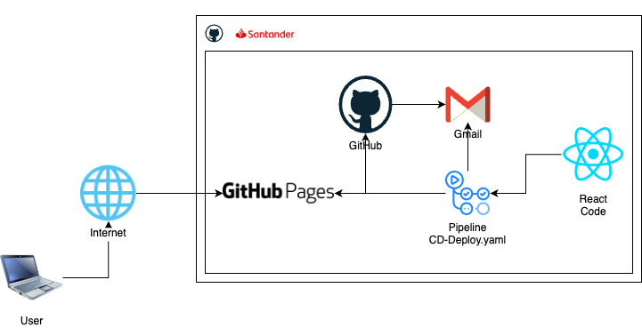
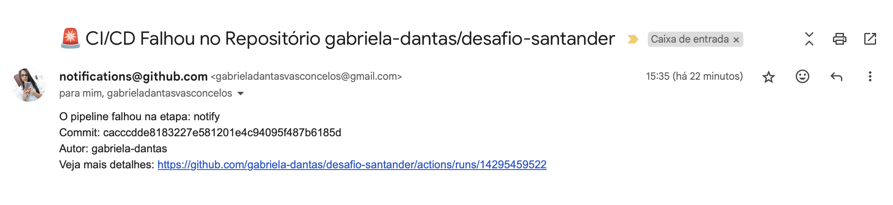

 # desafio-santander

### URL do Site
https://gabriela-dantas.github.io/desafio-santander/

### SonarQube

  

### Projeto
   

### Notificações
Além da notificação enviada diretamente pelo GitHub, adicionei um step na pipeline para envio de e-mails apenas em caso de erros:
   

### Explicando o teste unitário que se encontra no diretório src/App.test.js

✅ import { render, screen } from "@testing-library/react";

    render: simula a renderização do componente na tela (como se ele estivesse aparecendo no navegador).

    screen: permite acessar os elementos que foram renderizados.

✅ import App from "./App";

    Está importando o seu componente App para ser testado.

✅ test("renders Hello World text", () => { ... });

    Essa é a definição de um teste unitário.

    A primeira parte ("renders Hello World text") é a descrição do que o teste deve fazer.

    A segunda parte (a função) contém a lógica do teste.

✅ render(<App />);

    Aqui o componente App é renderizado em um ambiente de teste.

    É como se você abrisse a página do seu app no navegador.

✅ const helloWorldText = screen.getByText(/hello world./i);

    Essa linha procura na tela renderizada um elemento que contenha o texto "Hello World.".

    O /hello world./i é uma expressão regular:

        O i no final quer dizer que a busca ignora maiúsculas/minúsculas.

✅ expect(helloWorldText).toBeInTheDocument();

    Aqui é onde o teste de verdade acontece.

    Ele está dizendo: “Espero que o elemento com o texto 'Hello World.' esteja presente no documento”.

📌 Resultado

Se o texto "Hello World." existir na tela renderizada pelo App, o teste passa ✅
Se não existir, o teste falha ❌
     

